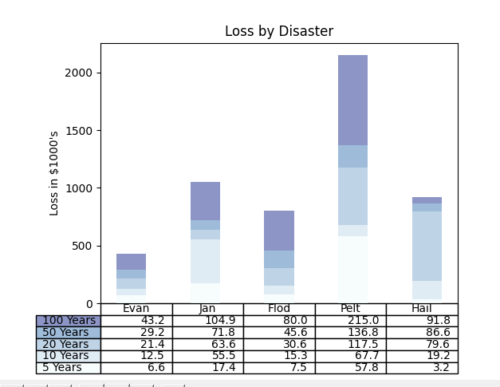
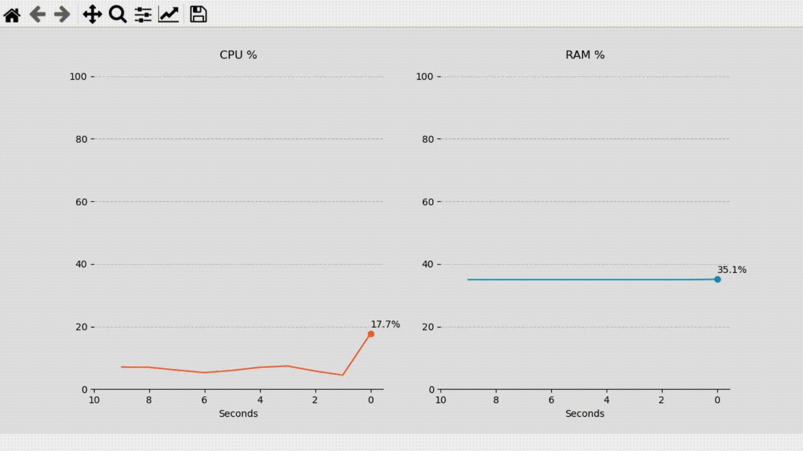
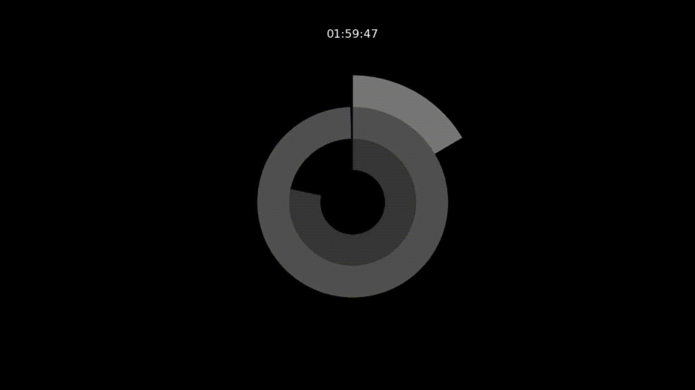

# Matplotlib-real-time Data Vizualization

#### Data Visualization using Matplotlib in a virtual environment

>>datavisuals.py

Raw CPU and RAM live data
CPU_final - Same as before, but with more details:  

  

>>first.py

Intermediatte bar plot and outputs as image    

  

>>second.py

Simple bar and scatter plots    

Student results visualization:  

  

#### Real-time data visualization with Matplotlib's FuncAnimation

Code from the article:  

#### Scripts 

>>CPU_v1.py
Draw two simple charts with CPU and memory information:  

  

>>CPU-LiveData.py

CPU_final - Same as before, but with more details: 

  

>>Map.py

Map - Plots a map with data from an Excel file:  

  

>>Clock-time.py

Clock - Plot a donut chart clock:  

  

