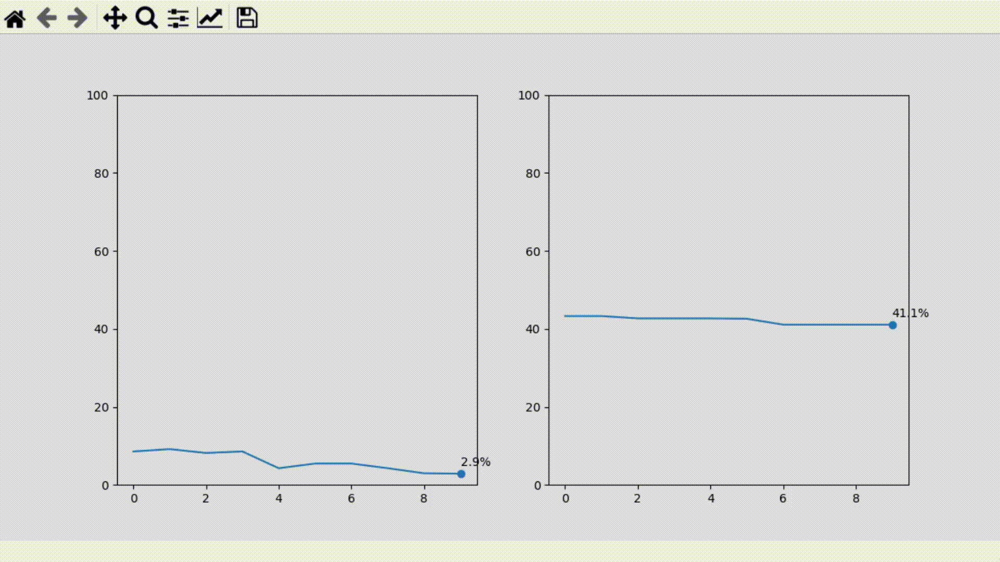

# Matplotlib-real-time Data Vizualization

#### Data Visualization using Matplotlib in a virtual environment

>>datavisuals.py

Raw CPU and RAM live data
CPU_final - Same as before, but with more details:  

  

>>first.py

Intermediatte bar plot and outputs as image    

  

>>second.py

Simple bar and scatter plots    

Student results visualization:  

  

#### Real-time data visualization with Matplotlib's FuncAnimation

Code from the article:  

#### Scripts 
 

>> CPU_v1.py
Draw two simple charts with CPU and memory information:    

  
 

>> CPU-LiveData.py

CPU_final - Same as before, but with more details:   

  
 

>> Map.py

Map - Plots a map with data from an Excel file:    

 
   

>> Clock-time.py

Clock - Plot a donut chart clock:    

  

