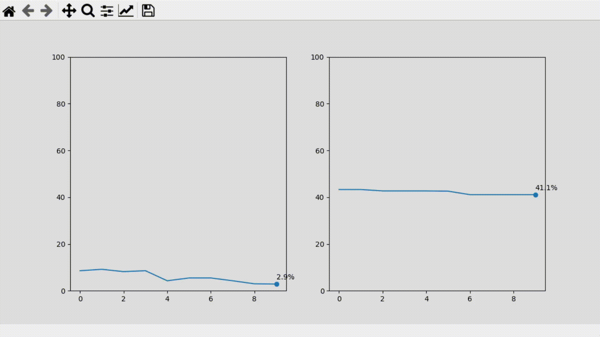
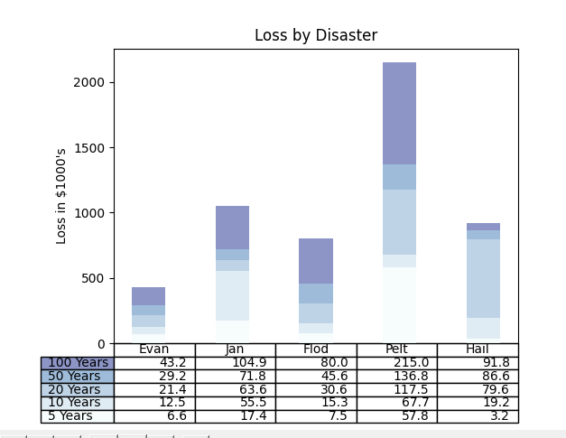
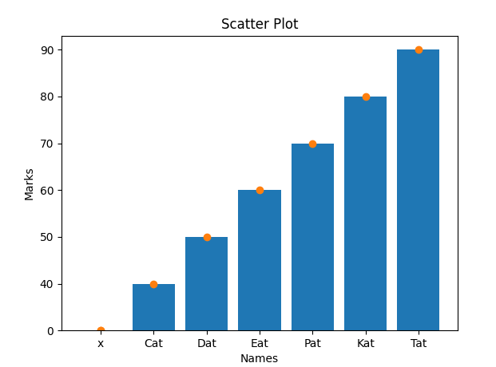

# Python - Data Visualization

>> Data Visualization using Matplotlib, Plotly & Streamlit in a virtual environment

```
Table of Content
.
├── Matplotlib-real-time Data Vizualizaion
├── plant_analytics
├── res
├── README.md
├── datavisuals.py
├── first.py
├── pyplot-table-original.png
├── requirements.txt
└── second.py
```


### Data Visualization using Matplotlib in a virtual environment

>>datavisuals.py

Raw CPU and RAM live data
CPU_final - Same as before, but with more details:  
  

>>first.py

Intermediatte bar plot and outputs as image <br>
  

>>second.py

Simple bar and scatter plots <br>
Student results visualization:  
  
