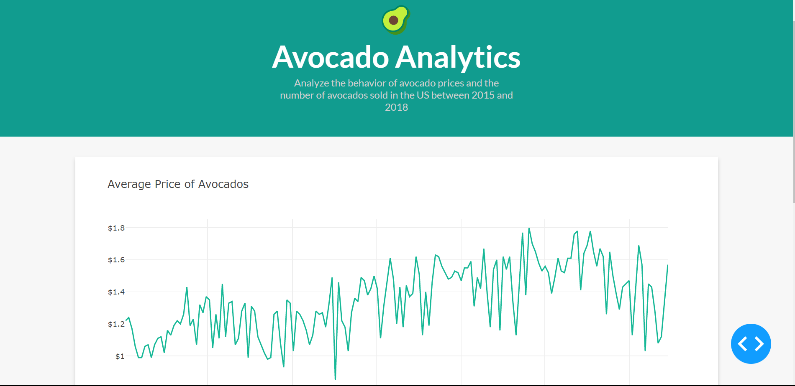
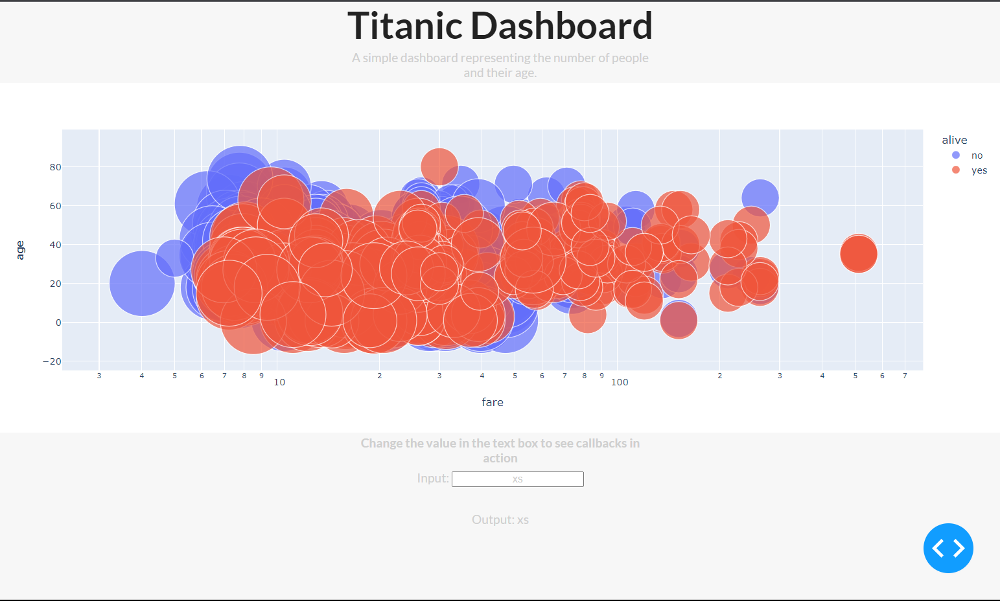
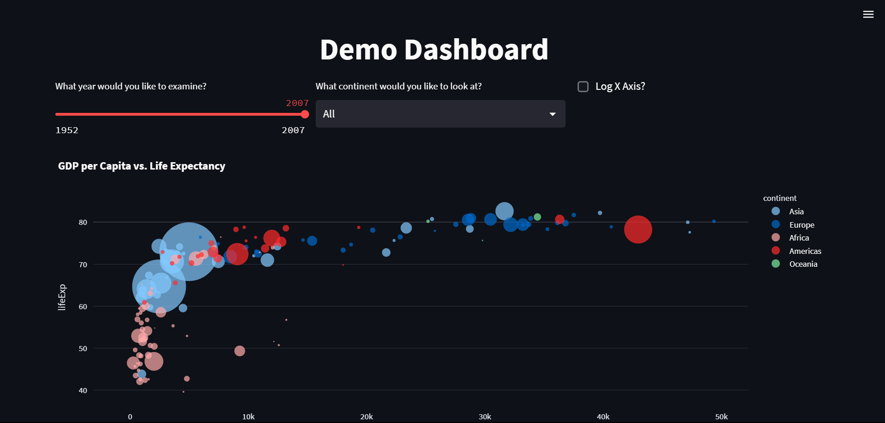

# Interactive Dashboards

## Dash by Plotly
To try out Dash, install the package first. 
```
pip install dash
```

>>app.py
Analyzing the behavior of avocado prices and the number of avocados sold in the US between 2015 and 2018

To run the file `app.py`:
```
python app.py
```
or
```
python3 app.py
```

  


>>titanic.py
A simple Titanic Dashboard

To run the file `titanic.py`:
```
python titanic.py
```
or
```
python3 titanic.py
```

  


## Streamlit
>>stream.py

Data examining GDP per Capita vs. Life Expectancy for different continents

Install the Streamlit package first.
```
pip install streamlit
```

After, run the file in the terminal using the following code.

```
streamlit run stream.py
```
  